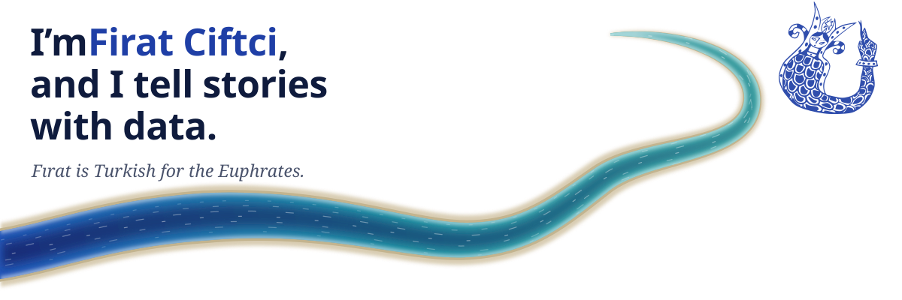

<picture>
  <source media="(prefers-color-scheme: dark)" srcset="river-dark.svg">
  
</picture>

I have built dictionaries of Turkish, archives at the [University of Chicago](https://digitalculture.uchicago.edu), and a map of every licensed dog in New York. I live in Brooklyn.

**Down the river**

- [Every Dog in New York](https://everydog.nyc), all 96,459 licensed dogs in New York City, by neighborhood
- [Nişanyan Sözlük](https://www.nisanyansozluk.com), the etymological dictionary of Turkish, with its sister sites for [place names](https://www.nisanyanyeradlari.com) and [given names](https://www.nisanyanadlar.com)
- [OCHRE](https://ochre.uchicago.edu) websites at the University of Chicago, among them [Ottoman Inscriptions](https://ochre.uchicago.edu/ottoman-inscriptions) and [Cinemetrics](https://cinemetrics.uchicago.edu)

**Smaller streams**

- [`ochre-sdk`](https://github.com/uchicago-digitalculture-webdev/ochre-sdk), the TypeScript library under the OCHRE websites
- [`@nanostores/svelte-runes`](https://github.com/nanostores/svelte-runes), Svelte 5 runes for Nano Stores
- [`eslint-plugin-inline-utilities`](https://github.com/firatciftci/eslint-plugin-inline-utilities), which keeps utility classes on the element they style
- Fixes upstream in [Knip](https://github.com/webpro-nl/knip), [OpenSeadragon](https://github.com/openseadragon/openseadragon), [svelte-maplibre](https://github.com/dimfeld/svelte-maplibre), [taze](https://github.com/antfu-collective/taze), and [prettier-plugin-tailwindcss](https://github.com/tailwindlabs/prettier-plugin-tailwindcss)

Most of my work lives in private repositories. See more at [firatciftci.com](https://www.firatciftci.com).
